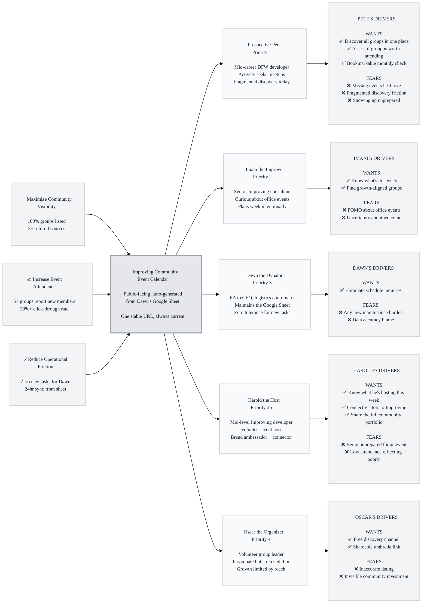

# Trigger Map Poster: air-pods-cohort-1

> Visual overview connecting business goals to user psychology

**Created:** 2026-03-05
**Author:** Saga (Dream Mode)
**Methodology:** Based on Effect Mapping (Balic & Domingues), adapted for WDS framework

---

## Strategic Documents

This is the visual overview. For detailed documentation, see:

- **01-Business-Goals.md** - Full vision statements and SMART objectives
- **02-Target-Groups.md** - All personas with complete driving forces and scoring
- **03-Feature-Impact-Analysis.md** - Prioritized features with impact scores

---

## Vision

Make Improving's community investment visible to the DFW tech ecosystem — every hosted event discoverable, every group findable — through a public calendar that requires zero new work from anyone.

---

## Business Objectives

### Objective 1: Maximize Community Visibility

- **Metric:** External referral sources pointing to the calendar
- **Target:** 3+ sources (blog posts, social shares, organizer links)
- **Timeline:** 3 months post-launch

### Objective 2: Increase Event Attendance

- **Metric:** Organizer-reported new attendees who discovered group via calendar
- **Target:** At least 5 groups report new members
- **Timeline:** 6 months post-launch

### Objective 3: Reduce Operational Friction

- **Metric:** Zero new maintenance tasks required from Dawn
- **Target:** Dawn's workflow unchanged
- **Timeline:** At launch

---

## Target Groups (Prioritized)

### 1. Prospective Pete (Pete the Prospect) — External Community Member

**Priority Reasoning:** Pete is the primary audience. Every design decision serves him first. Without Pete finding and using the calendar, no business goal is achieved.

> Mid-career DFW developer who'd attend more meetups if he could find them. Pragmatic about time, frustrated by fragmented discovery, motivated by professional community.

**Key Positive Drivers:**
- Discover all relevant DFW tech groups in one place (14 HIGH)
- Quickly assess if a group is worth attending (13 MEDIUM)
- Have a bookmarkable link to check monthly (12 MEDIUM)

**Key Negative Drivers:**
- Fear of missing events he'd love (14 HIGH)
- Frustration with fragmented discovery (14 HIGH)
- Anxiety about showing up unprepared (10 LOW)

---

### 2. Imani the Improver — Internal Employee

**Priority Reasoning:** Imani is a force multiplier — she uses the calendar herself AND becomes an internal ambassador who shares it with new hires, clients, and colleagues.

> Senior Improving consultant who's walked past buzzing meetup rooms without knowing what's inside. Curious but protective of her time, plans her week intentionally.

**Key Positive Drivers:**
- Know what's happening in my own building this week (14 HIGH)
- Find groups aligned with my professional growth (11 MEDIUM)

**Key Negative Drivers:**
- FOMO about groups meeting in my own office (13 MEDIUM)
- Uncertainty about whether she's welcome (9 LOW)

---

### 2b. Harold the Host — Internal Employee (Event Host)

**Priority Reasoning:** Harold is Improving's human interface at every event — the brand ambassador who turns first-time visitors into repeat attendees and soft-connects them with Improving's offerings. He uses the calendar as a preparation tool, not a discovery tool.

> Mid-level developer who volunteered as event host. Natural connector, soft brand ambassador, loves swag and conversation. Facilitates community, doesn't just consume it.

**Key Positive Drivers:**
- Know what events he's hosting this week so he can prepare (14 HIGH)
- Connect visitors with Improving's people and offerings naturally (11 MEDIUM)
- Share a professional link showcasing the full community portfolio (11 MEDIUM)

**Key Negative Drivers:**
- Being unprepared for an event — wrong room, not enough food (13 MEDIUM)
- Low attendance reflecting poorly on Improving's investment (10 LOW)

---

### 3. Dawn the Dynamo — Internal Logistics Coordinator

**Priority Reasoning:** Dawn is the sustainability condition. If her burden increases, the product fails. She's a constraint, not a traditional user — design FOR her by designing AROUND her.

> Executive Assistant to the CEO. Maintains the Google Sheet. Zero tolerance for new tasks. Every inquiry the calendar answers is one she doesn't field.

**Key Positive Drivers:**
- Eliminate "what's coming up?" inquiries entirely (15 HIGH)

**Key Negative Drivers:**
- Fear of any new maintenance burden (15 HIGH)
- Anxiety about data accuracy being her responsibility (10 LOW)

---

### 4. Oscar the Organizer — External Group Leader

**Priority Reasoning:** Oscar benefits from the calendar as free marketing. He's a stakeholder and content source, not a primary user.

> Volunteer who runs a DFW meetup at Improving's space. Passionate but stretched thin. His growth constraint is reach, not content quality.

**Key Positive Drivers:**
- Free discovery channel for new members (12 MEDIUM)
- Shareable umbrella link (11 MEDIUM)

**Key Negative Drivers:**
- Fear of inaccurate listing (11 MEDIUM)
- Frustration with invisible community investment (12 MEDIUM)

---

## Trigger Map Visualization

---

## Design Focus Statement

Every design decision flows left-to-right through this map: **Does it serve a business goal → through the platform → for a prioritized target group → by addressing their highest-scoring driving force?**

**Primary Design Target:** Prospective Pete (Priority 1)

**Must Address:**
- Unified discovery of all Improving-hosted groups (Pete +14, Imani +14)
- Elimination of fragmented search across multiple platforms (Pete +14)
- Zero-burden automation from Dawn's existing sheet (Dawn +15)
- Clear event details enabling quick attend/skip decisions (Pete +13)

**Should Address:**
- This-week view for internal employees (Imani +14)
- Event prep details for hosts — group name, expected attendance, organizer (Harold +14)
- Cancellation visibility preventing wasted trips (Oscar +11)
- Shareable stable URL for organizer promotion (Oscar +11, +12, Harold +11)

---

## Cross-Group Patterns

### Shared Drivers

- **Discovery in one place** — Pete, Imani, Harold, and Oscar all benefit from a single unified view. This is the product's core value proposition across all groups.
- **Accuracy and trust** — Pete needs accurate dates to plan, Dawn fears blame for inaccuracy, Oscar fears wrong listings. Data accuracy is a cross-cutting concern that serves everyone.
- **Low/zero effort** — Pete wants fast scanning, Dawn wants zero new tasks, Oscar wants free marketing, Harold wants self-serve prep info. Every group values efficiency.

### Unique Drivers

- **Pete's fragmentation pain** — Only Pete experiences the active frustration of checking multiple Meetup pages. This is the sharpest pain point.
- **Imani's insider FOMO** — Unique to internal employees who literally walk past events they don't know about.
- **Harold's preparation drive** — Unique to the host role. Harold doesn't discover events — he prepares for them. His calendar use is operational, not exploratory.
- **Dawn's maintenance anxiety** — No other group shares her zero-burden constraint. This is an architectural requirement, not a UX feature.

### Potential Tensions

- **Completeness vs. accuracy:** The Product Brief prioritizes completeness (list everything) over precision (real-time updates). This serves Pete and Oscar (more events visible) but could stress Dawn if inaccurate data is perceived as her fault. Mitigation: clear "last updated" timestamps and "best-effort" messaging.
- **Pete's desire for rich details vs. Dawn's zero-burden constraint:** Pete wants group descriptions, topic tags, and attendance data. This requires the Google Sheet to contain those fields. If it doesn't, adding columns = new burden for Dawn. Mitigation: only display data already in the sheet.

---

## Next Steps

This Trigger Map Poster provides a quick reference. For detailed work:

- [ ] **Review detailed docs** - See 01-Business-Goals.md, 02-Target-Groups.md, 03-Feature-Impact-Analysis.md
- [ ] **Use for Feature Prioritization** - Reference feature impact scores in 03-Feature-Impact-Analysis.md
- [ ] **Guide UX Design** - Ensure designs address priority drivers (Pete's discovery + Dawn's zero-burden)
- [ ] **Validate with Users** - Test assumptions with real target group members (especially Dawn)
- [ ] **Proceed to Phase 3: UX Scenarios** - Use Freya to create user journeys grounded in these personas and driving forces

---

_Generated with Whiteport Design Studio framework_
_Trigger Mapping methodology credits: Effect Mapping by Mijo Balic & Ingrid Domingues (inUse), adapted with negative driving forces_
